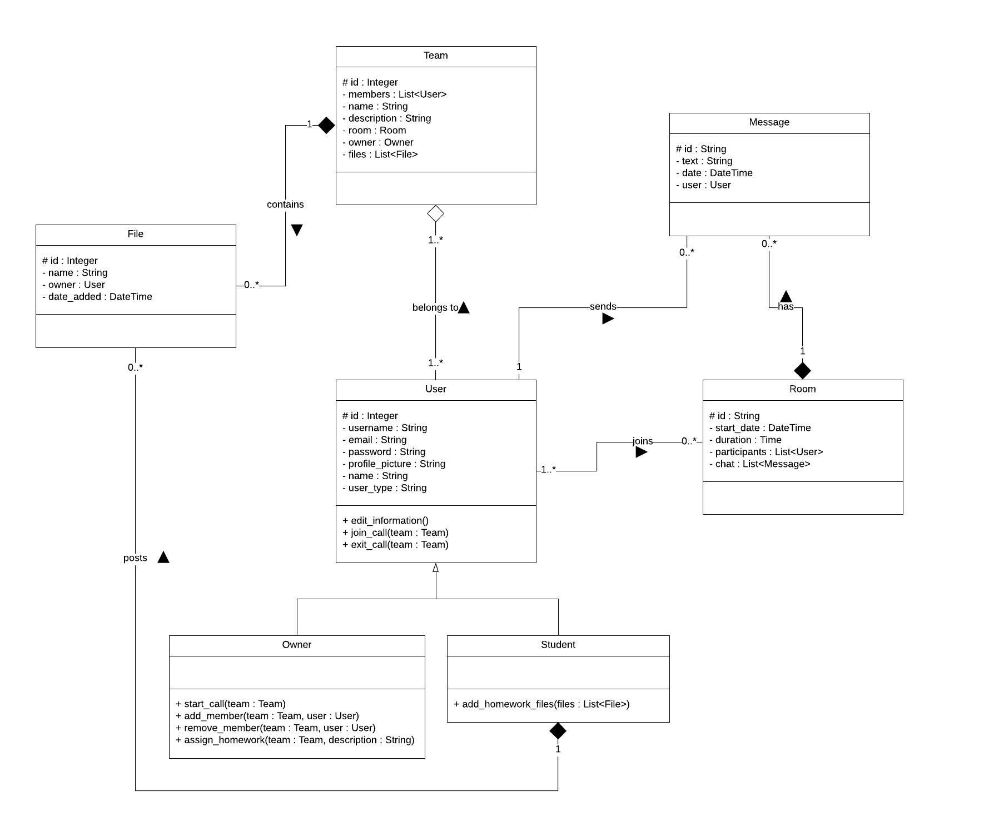
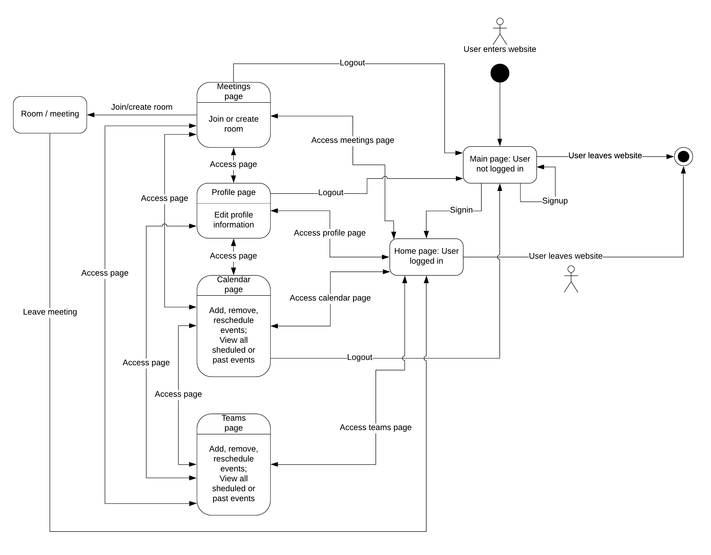

# Meetsy

## Software development requirements
✅ <a href = "https://trello.com/b/UBKxahVz/meetsy"> user stories</a> (at least 10) and backlog creation - 2p

✅ design, architecture, UML - 2p

✅ source control - 2p
  - <a href="https://github.com/stanbianca/Meetsy/branches">branch creation</a>: one branch for each developer
  - <a href="https://github.com/stanbianca/Meetsy/commit/dbe845c7ca21b3ee2ece5c90621ee72d3a40d072">merge</a> / <a href = "https://github.com/stanbianca/Meetsy/network">rebase</a>
  - <a href="https://github.com/stanbianca/Meetsy/commits/main">at least 10 commits </a>
   
✅ bug reporting - 1p
  - see <a href = "https://github.com/stanbianca/Meetsy/issues?q=is%3Aissue+is%3Aclosed"> issues </a>

✅ build tool - 1p
  - npm run build - preparing the project for deployment

✅ refactoring, code standards - 1p
  - <a href="https://marketplace.visualstudio.com/items?itemName=planbcoding.vscode-react-refactor">VSCode React Refactor</a> extension
  - <a href="https://marketplace.visualstudio.com/items?itemName=dbaeumer.vscode-eslint">ESLint</a> extension
  - manual refactoring

✅ design patterns - 1p
  - <a href="https://github.com/stanbianca/Meetsy/commit/75b5fb32f47d8e371df8aed9232edc3b8ea6b8fa#diff-8146540cfd8c562ade7fd89c5b837c5c96e60c9a30fd5325517a50654ec3b816"> react hooks </a>
  - <a href = "https://github.com/stanbianca/Meetsy/commit/881e2157f28a2204ac6cdd206e02d6e1f64b9a1d#diff-f9ff088afe35880a473519f08d83e8bcc098179814da0edb41c094529c67e559"> singleton </a>
